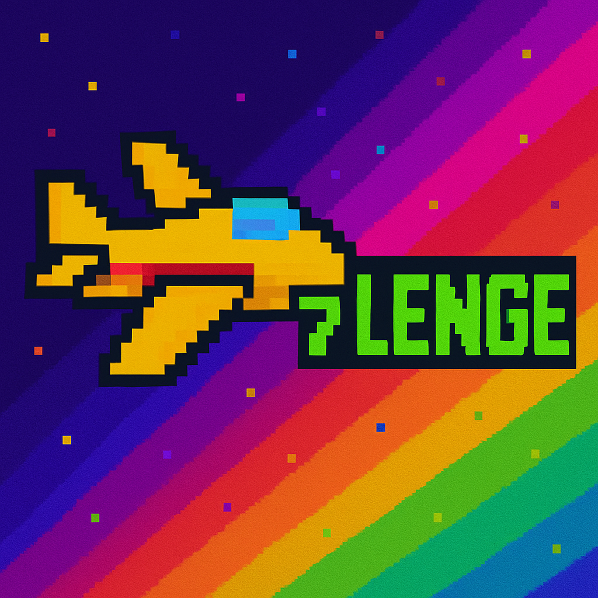
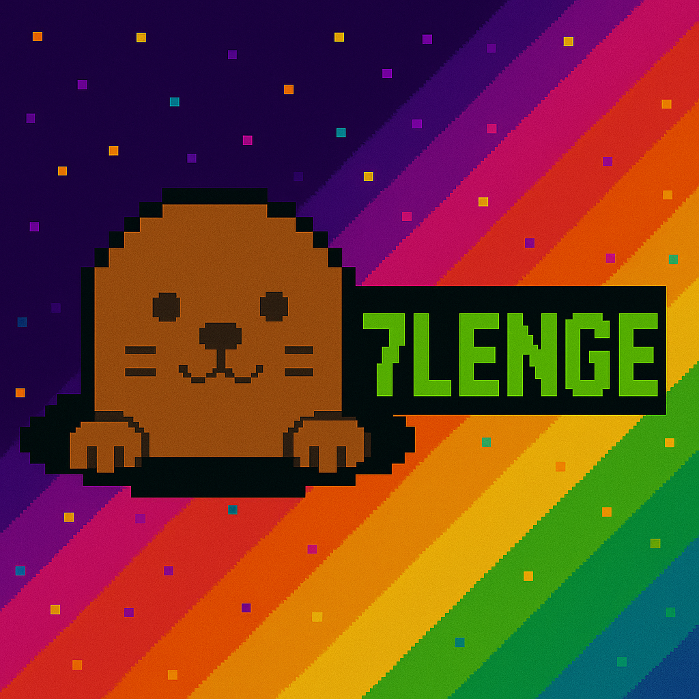
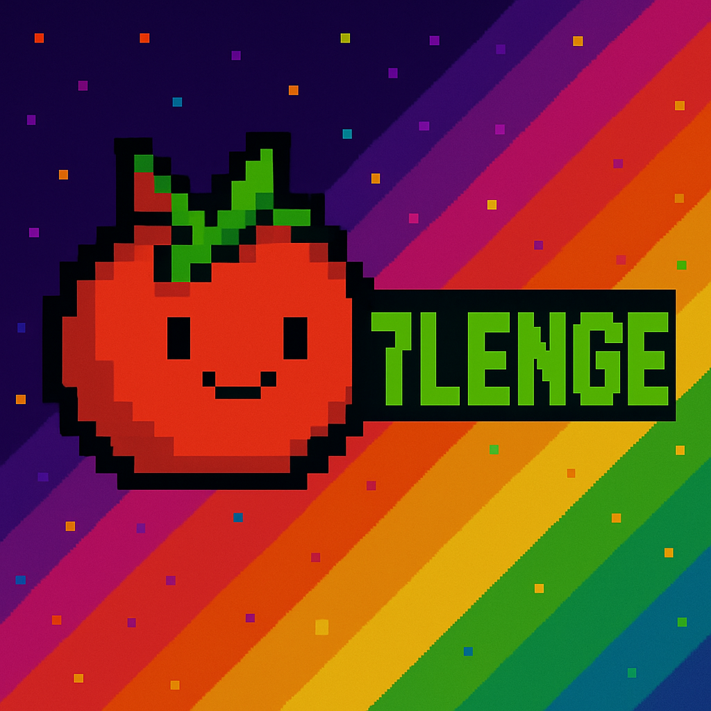

<h1 align="center"><b>🕹️7짱 오락실</b></h1>
<p align="center">
<이미지 - 오락실 화면 캡처 넣기>
</p>

<div align="center">


[](https://www.notion.so/7lenge-1ed73873401a80339678cb9ca4d1fe82)  [](https://github.com/FRONTENDBOOTCAMP-13th/JS-07-7zzang-Arcade/wiki)

</div>

과거의 **레트로풍 오락실 게임기**를 모티브로 한 웹 기반 미니 게임 플랫폼입니다.  
사용자가 동전을 넣으면 메인 화면이 작동하고, 이 화면에서 원하는 게임을 선택하여 플레이 할 수 있습니다.

<br>

## 📝프로젝트 개요

### 🎯 프로젝트명

**7짱오락실**

### 📌 프로젝트 목적

> - HTML/CSS/JavaScript를 기반으로 실제 게임 기능을 구현해보며 **프론트엔드 개발 실무 감각 향상**
> - 팀 단위 협업을 통해 **Git/GitHub 및 협업 도구 운용 능력 강화**
> - 사용자가 직접 즐길 수 있는 **미니 게임 플랫폼**을 완성해 **성과물을 배포하고 공유**하는 경험 획득

<hr>

### 🧩 팀명

**7lenge** (7 + Challenge)

### 👨‍👩‍👧‍👦 저희 7lenge를 소개할게요.

|                                                이호정                                                |                                              황유빈                                              |                                            김지수                                             |                                               배동초                                               |
| :--------------------------------------------------------------------------------------------------: | :----------------------------------------------------------------------------------------------: | :-------------------------------------------------------------------------------------------: | :------------------------------------------------------------------------------------------------: |
| [<br>Github](https://github.com/jeong0403) | [<br>Github](https://github.com/YouVin) | [<br>Github](https://github.com/sua17) | [<br>Github](https://github.com/kimlog126) |
|                                            Team Leader/PM                                            |                                                PL                                                |                                        Content Writer                                         |                                          Content Designer                                          |
|                                               한마디 ~                                               |                                             한마디 ~                                             |                                           한마디 ~                                            |                                              한마디 ~                                              |

<br>
<hr>

### ⚙️ 기술 스택 / 개발 환경

|       분류       |                                                                                                                                                                                        종류                                                                                                                                                                                        |
| :--------------: | :--------------------------------------------------------------------------------------------------------------------------------------------------------------------------------------------------------------------------------------------------------------------------------------------------------------------------------------------------------------------------------: |
|   **Frontend**   |    |
|    **UI/UX**     |                                                                                                                                                                                                                                                            |
|  **버전 관리**   |                                                                                                                                      |
| **커뮤니케이션** |                                                                                                                              |
|     **배포**     |                                                                                                                                                                                                                                                        |
|     **API**      |                                                                                                                                                                                                                                                      |

<hr>

### 👥 역할 분배

| 이름   | 맡은 역할               |
| ------ | ----------------------- |
| 이호정 | 출동! 동물특공대        |
| 황유빈 | 제 7우주, 인덱스 페이지 |
| 배동초 | 뿅뿅 두더지             |
| 김지수 | 토마토 박스             |

<hr>

### 💻 주요 기능

_게임 대표 소개글을 간단하게 한줄만 작성해주세요._

- **출동! 동물특공대** :
- **제 7우주** :
- **뿅뿅 두더지** :
- **토마토 박스** :

<hr>

### 📂 프로젝트 구조

_이건 넣을지 말지 논의 필요_

<hr>

### 📥 설치 가이드

```
# 프로젝트 클론

# 디렉토리 이동

# 의존성 설치

# 환경 변수 설정

# 개발 서버 실행
```

<hr>

### 🕹️ 실행 화면

_넣을지 논의 필요. 위키에도 사용설명서로 들어가긴 합니다. 만약 들어간다면 다음과 같이 진행해주세요._

> 1.  실행하는 화면 캡처 (영상 캡처 -> gif 변환)해서 넣어주세요.

> 2.  캡처 이미지 디렉토리에 넣지 마시고, 깃허브 이슈 생성 창에서 생성한 gif 붙여넣기 해서 나오는 링크 붙여 넣으면 됩니다.

> 3. 제목 부분은 실행 페이지가 무엇인지, or 어떤 게임인지 적어주세요. 설명은 프로젝트 개요 참고하셔서 간략히 작성해주세요.

> 4. 표 이전 부분 해당 페이지 or 게임에 대한 간단한 설명을 리스트로 작성해주세요.

```
# 표 양식

|  제목  |
| :----: |
| (캡처) |
```

### [메인]

- 주 설명
  - 부연 설명 (주 설명에서 할 수 있는 것들 ex. 버튼 클릭 시 ~를 할 수 있습니다.)

### [출동! 동물 특공대]

- 주 설명
  - 부연 설명

### [제 7우주]

- 주 설명
  - 부연 설명

### [뿅뿅 두더지]

- 주 설명
  - 부연 설명

### [토마토 박스]

- 주 설명
  - 부연 설명

<hr>

### ✨ 더 알아보기

저희 프로젝트는 [🕹️7짱오락실 바로가기](/)에서 경험해보실 수 있어요.

더 궁금하시다면 아래를 참고해주세요.

- ~~주요 기능이 궁금해요. 👉 [7짱오락실 사용 설명서 바로가기](/)~~ -> 실행 화면 논의 후 결정
- 프로젝트를 직접 설치하고 싶어요. 👉[설치 가이드 바로가기](/)
- 협업 방식을 알아보고 싶어요. 👉 [협업 가이드 바로가기](/)
- 사용한 기술이 궁금해요. 👉 [기술 스택 바로가기](/)
- 프로젝트를 하면서 겪은 이야기가 궁금해요. 👉 [개발 기록 바로가기](/)

다른 이야기는 📖[팀 위키](https://github.com/FRONTENDBOOTCAMP-13th/JS-07-7zzang-Arcade/wiki)에서 확인해 보실 수 있어요.
