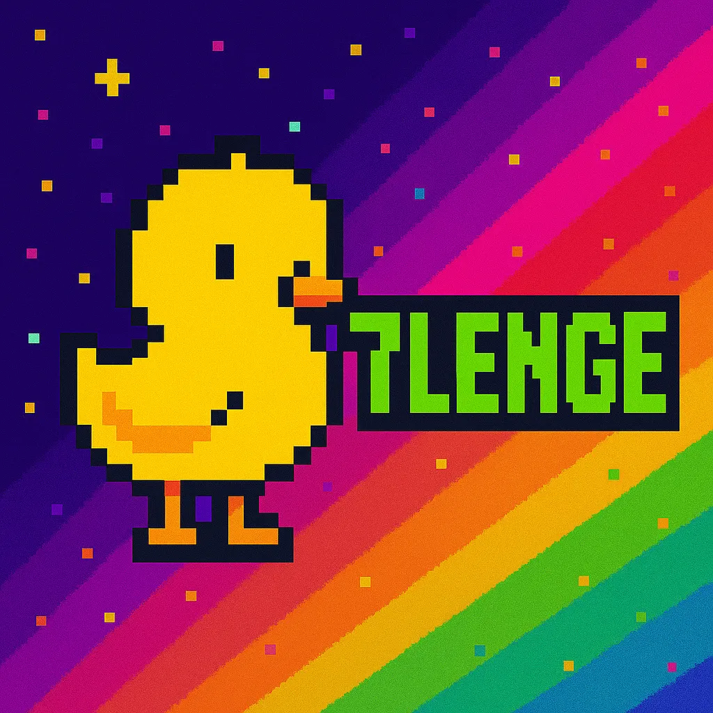
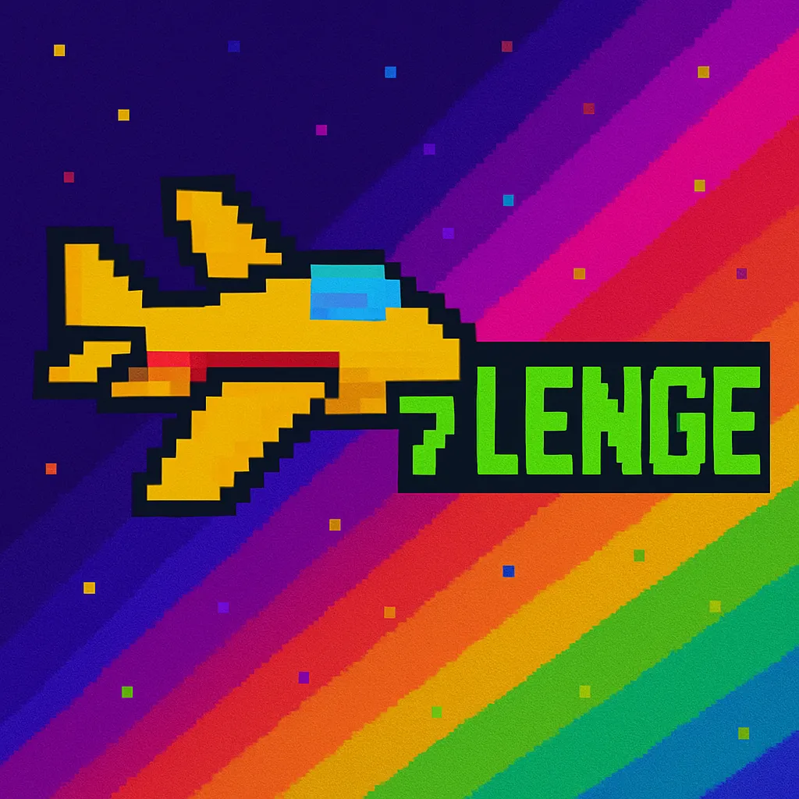
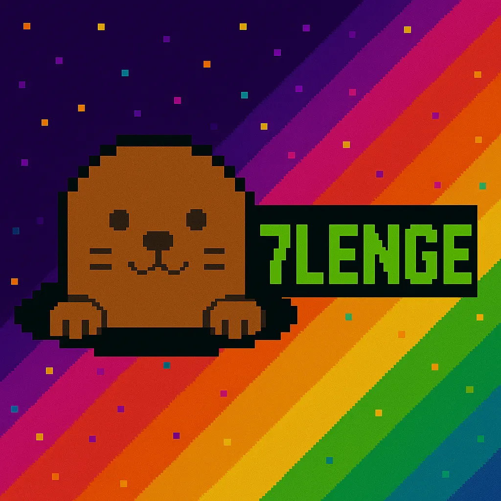

<h1 align="center"><b>🕹️7짱오락실</b></h1>

<i>by Team 7lenge</i>

 

처음이라 서툴렀지만
끝까지 해보자는 마음으로 달렸습니다.

**7lenge**의 '**Challenge**'가 반영된 이름처럼 도전했고, 끝까지 해냈습니다.

이제, 다음 스테이지로 갑니다. 🚀

---

## 

 

## 📝프로젝트 개요

### 🎯 프로젝트명

**7짱오락실(7ZZANG-ARCADE)**

### 📌 프로젝트 목적

> - HTML/CSS/JavaScript를 기반으로 실제 게임 기능을 구현해보며 **프론트엔드 개발 실무 감각 향상**
> - 팀 단위 협업을 통해 **Git/GitHub 및 협업 도구 운용 능력 강화**
> - 사용자가 직접 즐길 수 있는 **미니 게임 플랫폼**을 완성해 **성과물을 배포하고 공유**하는 경험 획득

### 🧩 팀명

**7lenge** (7 + Challenge)

### 👨‍👩‍👧‍👦 7lenge를 소개합니다

|  **이호정** [Github](https://github.com/jeong0403) |  **황유빈** [Github](https://github.com/YouVin) |  **배동초** [Github](https://github.com/sua17) |  **김지수** [Github](https://github.com/kimlog126) |
| :-----------------------------------------------------------------------------------------------------------------: | :-------------------------------------------------------------------------------------------------------------: | :------------------------------------------------------------------------------------------------------------: | :-----------------------------------------------------------------------------------------------------------------: |
|                                                **Team Leader / PM**                                                 |                                                     **PL**                                                      |                                               **Content Writer**                                               |                                                **Content Designer**                                                 |
|                                         🕹️ 계속 도전하시겠습니까? → YES                                          |                                  💪 ‘열심히’ 말고  ‘잘’ 하는 개발자가 되자                                   |                                           🚀 시간을 잘 쓰면 개발업!                                            |                                                👩‍💻 '뚝딱뚝딱 개발자'                                                 |

 

## 👥 팀 구성 및 역할

| 담당자 | 메인 역할           | 개발 참여                                  | 주요 기여 요약                                                                                         |
| ------ | ------------------- | ------------------------------------------ | ------------------------------------------------------------------------------------------------------ |
| 호정   | Team Leader / PM    | 🐤 출동! 동물특공대 게임 제작              | 🔹 팀 일정/업무/콘텐츠 기획 총괄 🔹 출동! 동물특공대 게임 설계 및 UI/로직 구현                      |
| 유빈   | PL (Project Leader) | 🔗 메인 페이지 제작, 🛸 제7 우주 게임 제작 | 🔹 프로젝트 구조 설계, Git 전략 수립 🔹 메인 페이지 로직 구현 및 제7 우주 게임 설계 및 UI/로직 구현 |
| 지수   | Content Designer    | 🍅 토마토 박스 게임 제작                   | 🔹 UI 디자인 전반 🔹 토마토 박스 게임 설계 및 UI/로직 구현                                          |
| 동초   | Content Writer      | 🐾🔨 뿡뿡 두더지 게임 제작                 | 🔹 프로젝트 회고 및 문서화 🔹 뿡뿡 두더지 게임 설계 및 UI/로직 구현                                 |

## 💻 실행 화면

### 🎮 메인

|                                                                                                                                                                                                          실행 화면                                                                                                                                                                                                          |
| :-------------------------------------------------------------------------------------------------------------------------------------------------------------------------------------------------------------------------------------------------------------------------------------------------------------------------------------------------------------------------------------------------------------------------: |
|  |

- 과거 오락실의 느낌을 살린 레트로풍 메인 화면으로, 유저가 동전을 투입하면 게임 선택 화면이 활성화됩니다.
  - 미니 게임 4종의 각 아이콘을 클릭하면 해당 게임 페이지로 이동합니다.
  - 우측 상단의 라디오 아이콘을 통해 BGM을 On/Off할 수 있습니다.

---

### 🐤 출동! 동물 특공대

|                                                실행 화면                                                 |
| :------------------------------------------------------------------------------------------------------: |
|  |

- 귀여운 병아리 캐릭터가 좌우로 움직이며 하늘에서 떨어지는 장애물을 피해 생존하는 2D 피하기 게임입니다.
  - 점수가 올라갈수록 **장애물 속도·빈도·패턴 증가**로 긴장감이 상승합니다.
  - 일정 점수마다 **캐릭터 진화 및 배경 전환 연출**로 성취감을 제공합니다.

---

### 🚀 제 7우주

|                                                                                                                                                                                                          실행 화면                                                                                                                                                                                                          |
| :-------------------------------------------------------------------------------------------------------------------------------------------------------------------------------------------------------------------------------------------------------------------------------------------------------------------------------------------------------------------------------------------------------------------------: |
|  |

- '스페이스 인베이더'를 오마주한 고전풍 슈팅 게임으로, 적을 제거하며 다음 라운드로 진입하는 구조입니다.
  - 적 전멸 시 다음 라운드가 진행되며, **적이 지면에 닿거나 피격되면 게임 오버**가 됩니다.
  - 점수 시스템, 충돌 판정, 게임 루프는 **`canvas`를 기반**으로 구현하였습니다.

---

### 🍅 토마토 박스

|                                                실행 화면                                                 |
| :------------------------------------------------------------------------------------------------------: |
|  |

- 숫자가 적힌 귀여운 토마토들을 드래그하여 **숫자의 합이 10**이 되면 제거하는 게임입니다.
  - 사용자는 마우스로 화면을 드래그 하여 사각형 영역을 선택할 수 있습니다.
  - **제한 시간 120초 내**에 최대한 많은 조합으로 토마토를 제거해야합니다.

---

### 🌟 뿅뿅 두더지

|                                                                                                                                                                                                          실행 화면                                                                                                                                                                                                           |
| :--------------------------------------------------------------------------------------------------------------------------------------------------------------------------------------------------------------------------------------------------------------------------------------------------------------------------------------------------------------------------------------------------------------------------: |
|  |

- 구멍에서 무작위로 튀어나오는 두더지를 뿅망치로 빠르게 클릭하여 30초 내에 점수를 획득하는 반응형 게임입니다.
  - 두더지는 **일반(+1점)과 희귀(+3점)** 두 종류로 등장합니다.
  - 남은 시간이 **10초 이하로 줄어들면 두더지 등장 속도가 증가**합니다.

---

### ⚙️ 기술 스택 / 개발 환경

|       분류       |                                                                                                                                                                                        종류                                                                                                                                                                                        |
| :--------------: | :--------------------------------------------------------------------------------------------------------------------------------------------------------------------------------------------------------------------------------------------------------------------------------------------------------------------------------------------------------------------------------: |
|   **Frontend**   |    |
|    **UI/UX**     |                                                                                                                                                                                                                                                            |
|  **버전 관리**   |                                                                                                                                      |
| **커뮤니케이션** |                                                                                                                              |
|     **배포**     |                                                                                                                                                                                                                                                        |
|     **API**      |                                                                                                                                                                                                                                                      |

---

## 💬 추가 정보

| 항목             | 설명                                                                                  |
| ---------------- | ------------------------------------------------------------------------------------- |
| 🔗 **배포 링크** | [Netlify 배포 링크](https://your-netlify-link.com)                                    |
| 📺 **실행 화면** | GIF 또는 시연 영상 링크 삽입                                                          |
| 📌 **Wiki 안내** | [팀 위키 바로가기](https://github.com/FRONTENDBOOTCAMP-13th/JS-07-7zzang-Arcade/wiki) |
|                  |

---

<i>🕹️ 7zzang-Arcade © 2025 LikeLion Team 7lenge</i>

